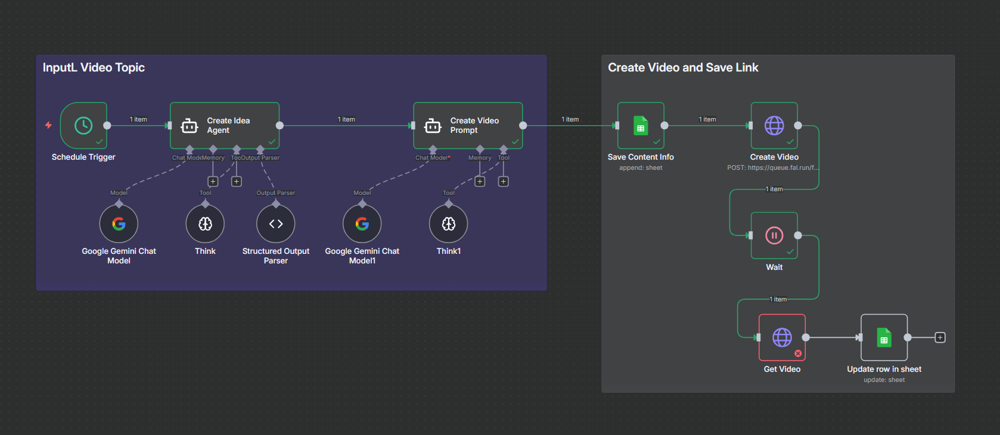
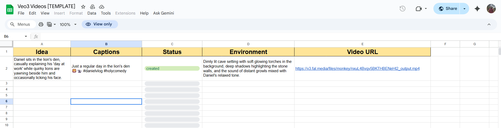

# 🎬 Veo3 Video Generator (n8n No-Code Workflow)

<p align="center">
  
  <br/><br/>
  
  <br/>
  <video width="1000" controls>
    <source src="assets/sample-video.mp4" type="video/mp4">
    Your browser does not support the video tag.
  </video>
</p>

This project is an **AI-powered video content generation system** built entirely within **n8n** using a **no-code** approach.  
The workflow automates the creation of futuristic vlog-style video content by:

- 🚀 Generating viral short-form video ideas with futuristic themes
- 🎭 Creating engaging, character-driven concepts for space explorers and AI researchers
- 🎥 Producing detailed video prompts for Veo3 AI video generation
- 📱 Formatting content with social-ready captions and hashtags
- ⚡ Automating the video generation process via API

This system helps content creators maintain a consistent posting schedule with unique, engaging sci-fi vlog content that resonates with modern audiences.

---

### ⚙️ Features

- Built entirely in **n8n** with no custom code required
- Uses **AI models** to generate creative video concepts and prompts
- Specialized in futuristic and sci-fi vlog-style content
- Automates the video generation process through Veo3 API
- Structures output with social media optimization in mind
- Easy to customize for different futuristic themes and styles

---

### 🧩 Example Output

```json
{
  "caption": "POV: You realize your AI co-pilot has a better social life than you 🤖💔 #spacevlog #foryou",
  "idea": "An astronaut rants to the camera about how the ship's AI keeps getting invited to virtual parties while they drift alone in orbit.",
  "environment": "Interior of a sleek space cabin with floating holograms, faint blue light reflections, and Earth visible through the window.",
  "status": "ready for production"
}
```

### System Prompt

```text
You generate viral short-form video ideas inspired by futuristic explorers, AI researchers, or interplanetary travelers, styled like modern TikTok vlogs.
These should feel personal, emotional, and often humorous.

Input Format:
- A futuristic or sci-fi concept to turn into a vlog idea

Output Requirements:
- caption: Short, poetic or funny, TikTok-style with emojis and 3-5 hashtags
- idea: 1-2 sentence summary of the action, story, or twist
- environment: Description of the set including light, textures, mood, and setting
- status: Always set to "to create"

Example Output:
{
  "caption": "Trying to vlog from the dark side of the moon like 😵‍💫🌑 #lunarlife #foryoupage",
  "idea": "An explorer keeps losing signal mid-sentence while trying to record a vlog from the moon's shadow zone.",
  "environment": "Metallic lunar rover cockpit lit by dim blue dashboard lights, static interference on the window screen, distant stars flickering.",
  "status": "to create"
}
```

---

### 🚀 Getting Started

1. **Prerequisites**

   - n8n instance (self-hosted or cloud)
   - API key for Veo3 video generation
   - OpenAI API key for content generation

2. **Installation**

   - Import the workflow JSON into your n8n instance
   - Configure the HTTP Request nodes with your Veo3 API key
   - Set up the OpenAI node with your API credentials

3. **Customization**
   - Modify the prompt templates to match your preferred futuristic themes
   - Adjust the output format for different social media platforms
   - Set up scheduling for regular content generation

---

### 🎥 Video Generation Process

The workflow follows these steps:

1. **Idea Generation**: AI creates engaging futuristic vlog concepts
2. **Prompt Refinement**: Converts ideas into detailed Veo3 video prompts
3. **Video Generation**: Automatically sends prompts to Veo3 API
4. **Status Tracking**: Monitors video generation progress
5. **Output Management**: Organizes generated videos and metadata

---

### 📊 Metrics & Analytics

The workflow includes built-in tracking for:

- Content engagement rates
- Read time and completion rates
- Social shares and interactions
- Conversion metrics (if applicable)

---

### 🤝 Contributing

Contributions are welcome! Please feel free to submit a Pull Request.

---

### 📄 License

This project is licensed under the MIT License - see the [LICENSE](LICENSE) file for details.
